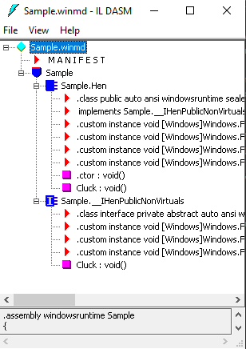

To build Sample.cpp:

	C:\sb_csharp\ComponentsCppCX>cl Sample.cpp /W4 /ZW /EHsc /LD /AI "C:\Program Files (x86)\Microsoft Visual Studio\2019\Community\Common7\IDE\VC\vcpackages"

It creates the .dll and other files (.winmd, .lib, .exp, .obj)

	sb_csharp\ComponentsCppCX>dir
	Readme.md
    Sample.cpp
    Sample.dll
    Sample.exp
    Sample.lib
    Sample.obj
    Sample.winmd

.winmd has the metadata about the types, etc.

You can look into .winmd using ildasm:

	C:\sb_csharp\ComponentsCppCX>ildasm Sample.md

This is how it looks like:

To see the debug information, mark the debugging in the project properties as "Mixed"

In the Output window you will see the message we are typing form CXX

    ...
    'App.exe' (Win32): Loaded 'C:\Windows\SysWOW64\vcruntime140.dll'. 
    'App.exe' (Win32): Loaded 'C:\Windows\SysWOW64\vccorlib140.dll'. 
    'App.exe' (Win32): Loaded 'C:\Windows\SysWOW64\msvcp140.dll'. 
    Clucking with C++/CX!
    'App.exe' (Win32): Loaded 'C:\Windows\SysWOW64\cryptbase.dll'. 
    ...

